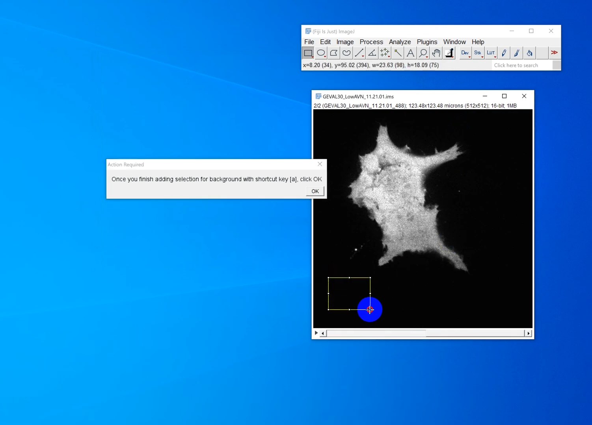

# GEVALIris
This directory stores the code for helping user process the images of cells expressing GTP evaluators (GEVAL). 
* This plugin was developed based on a Nature paper from Nikiforov lab (https://www.nature.com/articles/s41467-021-26324-6) and the corresponding  Biomedical Engineering Technologies protocol (https://pubmed.ncbi.nlm.nih.gov/35094327/).
* Because ImageJ macro language is very similar to JavaScript, all the codes were developed in JavaScript in WebStorm. 

##  Input image requirements
* All input files need to be in .ims format.
* After being imported, it should be a stack of 3 slices in the following order: 
  1. Image taken at 405 nm excitation.
  2. Image taken at 488 nm excitation. 
  3. (Optional) Bright-field.
     

## Installation & use 
1. Download the `GEVALIris.js` file locally and rename the file to `GEVALIris.ijm`.
2. From ImageJ -> Plugins -> Macros -> Install to install this `GEVALIris.ijm`.
3. From ImageJ -> Plugins -> Macros, you can see all the installed macros with the corresponding shortcut key in `[]`.
    * For common use, run `auto_everything` or press `Z`.
    * For debugging in a step-by-step manner, run each macro or press the corresponding key in order.
4. Enjoy your high-speed analysis! 

Watch the live demo of GEVALIris works here: https://youtu.be/aysFCivxEpw?t=1

## Code behaviour explanation 

### GEVALIris workflow abstract

### Image processing for 1 image
All the steps below have been incorporated into 1 big macro where it only requires human users to do 2 things: 
* Select out background areas by 3 rectangles . 
* Depending on the tracing mode...
  * If in threshold mode, adjust the bar for the threshold so the outline of cells can be determined. 
  * If in the tracing mode, manually trace the outline of the cell 

#### Better display and slice renaming
The raw .ims file tends to be very black. This part of the code adjusts the contrast on each channel automatically so the image is visible for the human eyes.
* This doesn't change the raw image data. 
* This excludes the bright-field image automatically. 

This part of the code also renames slices using "405", "488", and "brightfield", so they're easier to refer later. 

#### Background subtraction 
This section asks the user to make some selections on the background (can be done by the rectangle selection tool) in whatever number they like (3 selections are enough). Then an average intensity will be calculated from these selections and the average value will be used for subtraction from all the pixels
* This excludes the bright-file image

#### Background set to NaN 
This section asks the user to set a threshold for the outline of the cells so the background can be set to NaN to avoid an error caused by division by zero in a later step
* This is only done on the 488 nm excitation image since it will be used as the denominator

#### Generate ratio heatmap
This step generate and save the ratio heatmap from 405/488 images, save the heatmap and also an overlay of the heatmap on the bright-field

#### Generate montage
This step generate and save a montage of 405, 488, bright-field, and ratio heatmap in a 2 by 2 grid

#### Finish up
This step saves the stack used to make the montage in case you want to make changes to it later

Then this step closes all the windows generated from the initial input stack so the user is ready to process the next image

### Normalize all ratio heatmaps
After all the single images have been processed, you need to normalize all the ratio heatmaps together

This only requires the human user to select out the folder that stores all the ratio heatmaps and it'll do all the normalization and saving automatically

## Output structure
The code will create a folder called __Fiji_output__ on the desktop, if that folder doesn't already exist. The folder contains the following directories depending on whether your input stack contains the brightfield:

| Input stack types           | 3 slices (with brightfields)                                                                   | 2 slices (without brightfields)                                                      |
|-----------------------------|------------------------------------------------------------------------------------------------|--------------------------------------------------------------------------------------|
| Heatmap_images              | Both .jpg & .tif                                                                               | Both .jpg & .tif                                                                     |
| Heatmap_overlay_brightfield | Both .jpg & .tif                                                                               | N/A                                                                                  |
| Histogram_data              | 1 .csv                                                                                         | 1 .csv                                                                               |
| Histogram_images            | 1 .tif                                                                                         | 1 .tif                                                                               |
| Montage_images              | Both .jpg & .tif of 2 × 2 montage of 405 nm channel, 488 channel, brightfield, & ratio heatmap | Both .jpg & .tif of 1 × 3 monatge of 405 nm channel, 488 nm channel, & ratio heatmap |
| Processed_stacks            | 1 .tif                                                                                         | 1 .tif                                                                               |
| ROI                         | 1 .zip                                                                                         | 1 .zip                                                                               |